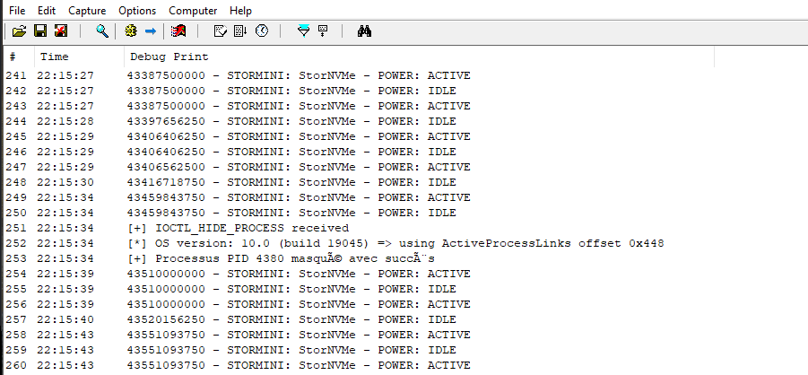
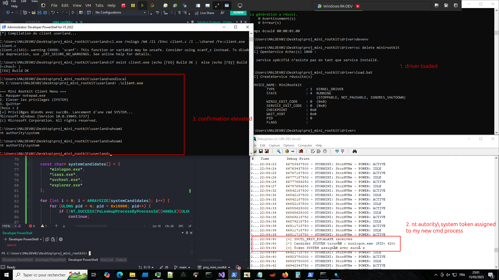

# Dans les Entrailles du Kernel Windows : Développement d'un Mini-Rootkit Éducatif

La programmation au niveau kernel représente l'un des domaines les plus fascinants et techniques de l'informatique. Récemment, j'ai eu l'opportunité de plonger dans cet univers complexe à travers un projet de développement d'un mini-rootkit Windows, dans le cadre d'un cours de sécurité avancée dispensé par Lionel Auroux à l'École 2600.

## Introduction au Monde du Kernel Windows

Avant de détailler le projet, il est essentiel de comprendre ce qu'implique la programmation kernel. Contrairement aux applications utilisateur qui évoluent dans un environnement protégé, les drivers kernel ont un accès direct et privilégié aux ressources système. Cette proximité avec le matériel et les structures internes du système d'exploitation offre des possibilités immenses, mais aussi des risques considérables.

### Qu'est-ce qu'un Rootkit ?

Un rootkit est un ensemble de logiciels conçus pour maintenir un accès persistant et furtif à un système informatique. Les rootkits kernel, en particulier, opèrent au niveau le plus privilégié du système, leur permettant de :

- Masquer leur présence et celle d'autres processus malveillants
- Intercepter et modifier les appels système
- Contourner les mécanismes de sécurité
- Maintenir des privilèges élevés

## Architecture Technique du Projet

### Structure Globale

Notre mini-rootkit était composé de trois éléments principaux :

```
proj_mini_rootkit/
├── driver/                    # Driver noyau (minifilter)
│   ├── mini_rootkit.c        # Code principal du driver
│   ├── mini_rootkit.vcxproj  # Projet Visual Studio
│   ├── mini_rootkit.inf      # Fichier d'installation
│   ├── build.bat             # Script de compilation
│   ├── load.bat              # Script de chargement
│   └── unload.bat            # Script de déchargement
├── userland/                 # Application cliente
│   ├── client.c              # Interface utilisateur
│   └── build_client.bat      # Script de compilation client
├── shared/                   # Structures partagées
│   └── mini_rootkit_shared.h # Définitions IOCTL
└── assets/                   # Documentation et captures
```

### Environnement de Développement

L'un des premiers défis rencontrés fut la mise en place de l'environnement de développement. La programmation kernel Windows nécessite des outils spécifiques :

**Pour le Driver :**
- Enterprise Windows Driver Kit (EWDK)
- Windows Driver Kit (WDK)
- Visual Studio avec les extensions kernel

**Pour l'Application Cliente :**
- Visual Studio Developer PowerShell
- SDK Windows classique

Cette séparation était nécessaire car les toolchains utilisent des bibliothèques et des configurations différentes, incompatibles entre elles.

## Fonctionnalités Implémentées

### 1. Masquage de Processus (Process Hiding)

La première fonctionnalité consistait à masquer un processus de la liste des processus système. Cette technique exploite la structure interne `_EPROCESS` utilisée par Windows pour gérer les processus.

#### Principe Technique

Chaque processus Windows est représenté par une structure `_EPROCESS` qui contient, entre autres, un champ `ActiveProcessLinks`. Ce champ est une liste doublement chaînée reliant tous les processus actifs du système.

```c
// Pseudocode simplифié
PEPROCESS targetProcess = PsLookupProcessByProcessId(targetPID);
if (targetProcess) {
    // Retirer le processus de la liste chaînée
    RemoveEntryList(&targetProcess->ActiveProcessLinks);
    // Le processus devient invisible pour les outils standards
}
```

#### Démonstration Pratique



Dans cette capture d'écran, nous pouvons observer :
1. **Avant masquage** : Le processus Notepad.exe avec le PID 4380 est visible dans le gestionnaire des tâches
2. **Après masquage** : Le même processus a disparu de la liste, tout en continuant à fonctionner normalement

La technique fonctionne parce que la plupart des outils de monitoring (Task Manager, Process Explorer, etc.) utilisent les APIs Windows standard qui parcourent la liste `ActiveProcessLinks` pour énumérer les processus.

### 2. Élévation de Privilèges par Manipulation de Tokens

La seconde fonctionnalité implémentée était l'élévation de privilèges par manipulation de tokens de sécurité Windows.

#### Contexte des Tokens Windows

Sous Windows, chaque processus possède un token de sécurité qui détermine ses privilèges et permissions. Le token contient :
- L'identité de l'utilisateur (SID)
- Les groupes d'appartenance
- Les privilèges accordés
- Les niveaux d'intégrité

#### Technique d'Élévation

Notre approche consistait à :
1. Localiser un processus système (NT AUTHORITY\SYSTEM)
2. Copier son token de sécurité
3. Remplacer le token du processus courant

```c
// Pseudocode de la technique d'élévation
PEPROCESS systemProcess = FindSystemProcess();
PEPROCESS currentProcess = PsGetCurrentProcess();

if (systemProcess && currentProcess) {
    PACCESS_TOKEN systemToken = PsReferencePrimaryToken(systemProcess);
    // Remplacer le token du processus courant
    PsReplacePrimaryToken(currentProcess, systemToken);
}
```

#### Résultat de l'Élévation



Cette capture montre le succès de l'opération :
- **Situation initiale** : Processus utilisateur standard
- **Après élévation** : Nouveau shell avec privilèges SYSTEM
- **Confirmation** : Le processus s'exécute maintenant avec les droits NT AUTHORITY\SYSTEM

## Communication Noyau-Utilisateur via IOCTL

L'interface entre le driver kernel et l'application utilisateur s'effectuait via des codes de contrôle d'entrée/sortie (IOCTL). Cette méthode permet une communication bidirectionnelle sécurisée entre les deux niveaux de privilège.

### Définition des Codes IOCTL

```c
// Codes de contrôle personnalisés
#define IOCTL_HIDE_PROCESS \
    CTL_CODE(FILE_DEVICE_UNKNOWN, 0x800, METHOD_BUFFERED, FILE_ANY_ACCESS)

#define IOCTL_ELEVATE_PRIVS \
    CTL_CODE(FILE_DEVICE_UNKNOWN, 0x801, METHOD_BUFFERED, FILE_ANY_ACCESS)
```

### Interface Utilisateur

L'application cliente présentait un menu simple permettant de tester les différentes fonctionnalités :

```
=== Mini Rootkit Client Menu ===
1. Masquer un processus (entrer PID)
2. Élever les privilèges (SYSTEM)
3. Quitter
Choix > 
```

## Défis et Obstacles Rencontrés

### Les Fameux Blue Screen of Death (BSOD)

La programmation kernel ne pardonne aucune erreur. Chaque faute de programmation peut résulter en un crash système complet, matérialisé par l'écran bleu redouté de tous les développeurs Windows.

Durant ce projet, j'ai collectionné de nombreux BSOD causés par :
- Accès à des pointeurs non valides
- Violations de mémoire kernel
- Mauvaise gestion des niveaux d'interruption (IRQL)
- Références de mémoire non déréférencées

Ces crashes, bien que frustrants, constituent un excellent apprentissage de la rigueur nécessaire en programmation système.

### Gestion de la Mémoire Kernel

En mode kernel, la gestion mémoire suit des règles strictes :
- Pas de heap managé automatiquement
- Nécessité d'utiliser des pools kernel spécifiques
- Attention particulière aux niveaux IRQL lors des allocations

### Signatures de Driver et Test Signing

Pour des raisons de sécurité, Windows exige que les drivers soient signés numériquement. En développement, il faut :
- Activer le mode test signing
- Utiliser des certificats de test
- Configurer correctement le Boot Configuration Data (BCD)

## Implications en Sécurité Informatique

### Perspective Défensive

Ce projet éducatif révèle l'importance cruciale de comprendre les techniques offensives pour développer des défenses efficaces. Les insights obtenus permettent de :

**Améliorer la Détection :**
- Surveiller l'intégrité des listes de processus
- Monitorer les modifications de tokens
- Détecter les drivers non signés ou suspects

**Renforcer les Mécanismes de Protection :**
- Implémentation de PatchGuard (Kernel Patch Protection)
- Utilisation de technologies comme HVCI (Hypervisor-protected Code Integrity)
- Monitoring comportemental avancé


## Aspects Éthiques et Légaux

Il est crucial de souligner que ce projet s'inscrivait dans un cadre purement éducatif et de recherche en sécurité. L'utilisation de ces techniques à des fins malveillantes constitue une violation grave de la loi.

### Responsabilité du Chercheur

En tant que professionnel de la cybersécurité, il est de notre responsabilité de :
- Utiliser ces connaissances exclusivement à des fins défensives
- Contribuer à l'amélioration de la sécurité globale
- Sensibiliser aux risques et vulnérabilités
- Respecter les principes de divulgation responsable

## Retour d'Expérience et Apprentissages

### Compétences Techniques Acquises

Ce projet m'a permis de développer des compétences techniques approfondies en :
- **Programmation système Windows** : Maîtrise des APIs kernel et des structures internes
- **Reverse Engineering** : Compréhension des mécanismes internes de Windows
- **Analyse de Malware** : Capacité à identifier et analyser les techniques rootkit
- **Développement de Driver** : Expérience pratique du développement kernel

### Leçons de Cybersécurité

Au-delà des aspects techniques, ce projet a renforcé ma compréhension de :
- La complexité inhérente de la sécurisation des systèmes d'exploitation
- L'importance de la défense en profondeur
- L'évolution constante du paysage des menaces

## Perspectives et Améliorations Futures

### Extensions Possibles

Le projet pourrait être étendu avec :
- **Masquage de fichiers et répertoires** : Manipulation du système de fichiers
- **Keylogger kernel** : Capture de frappes clavier au niveau matériel
- **Rootkit UEFI** : Persistance au niveau firmware
- **Techniques d'anti-forensic** : Effacement de traces d'activité

### Technologies Émergentes

L'évolution vers des architectures de sécurité basées sur la virtualisation (VBS, HVCI) ouvre de nouvelles perspectives de recherche en :
- Hypervisor-based rootkits
- Exploitation de vulnérabilités SMM (System Management Mode)
- Techniques d'évasion des sandboxes matérielles

## Conclusion

Ce projet de développement de mini-rootkit constitue une expérience formative exceptionnelle dans le domaine de la cybersécurité. Au-delà de l'acquisition de compétences techniques pointues, il sensibilise aux défis complexes de la sécurisation des systèmes informatiques modernes.

La compréhension approfondie des mécanismes d'attaque représente un prérequis indispensable pour tout professionnel de la cybersécurité souhaitant développer des défenses efficaces. Comme le disait Sun Tzu : "Connais ton ennemi et connais-toi toi-même."

Cette expérience renforce ma conviction que la formation en cybersécurité doit inclure une composante pratique forte, permettant aux futurs professionnels de comprendre concrètement les techniques utilisées par les acteurs malveillants.

---

**Disclaimer :** Cet article présente un projet réalisé dans un cadre pédagogique strict sous supervision académique. Les techniques décrites ne doivent être utilisées qu'à des fins éducatives, de recherche en sécurité, et dans le strict respect de la légalité. L'auteur décline toute responsabilité quant à l'utilisation malveillante de ces informations.

---

*Si vous souhaitez approfondir ces sujets, je recommande vivement les ressources suivantes :*
- Windows Internals (Mark Russinovich)
- Rootkits and Bootkits (Sergey Bratus)
- Windows Kernel Programming (Pavel Yosifovich)
